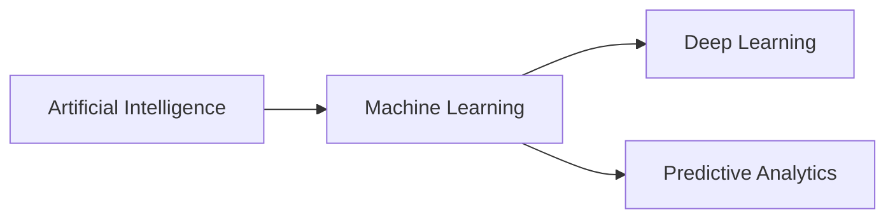

# Machine Learning (ML)

This is a library of deep learning and predictive analytics written from scratch in Elixir.

## Installation

Given this is project was created for educational purposes it's not on available in [Hex](https://hex.pm).

To install clone this repo and run `mix test`.

## Guides

TODO: Add links to the livebook notebooks.
