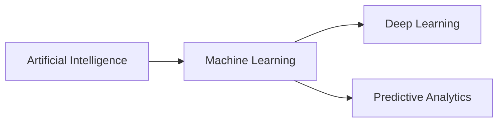

# Machine Learning (ML)

This is a library of deep learning and predictive analytics written from scratch in Elixir.



## Installation

Given this is project was created for educational purposes it's not on available in [Hex](https://hex.pm).
However, if you want, the package can be installed by adding `m_l` to your list of dependencies in `mix.exs`:

```elixir
def deps do
  [
    {:m_l, git: "https://github.com/scrubmx/machine_learning.git", tag: "0.1.0"}
  ]
end
```

## Guides

* [ML Guides](livebooks.html)
